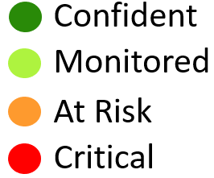
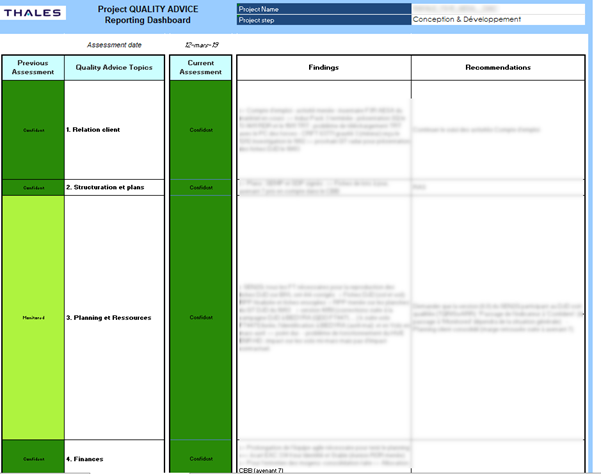
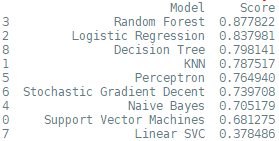
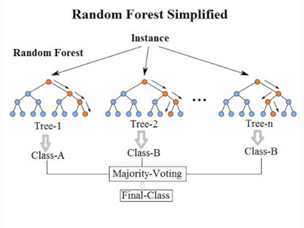
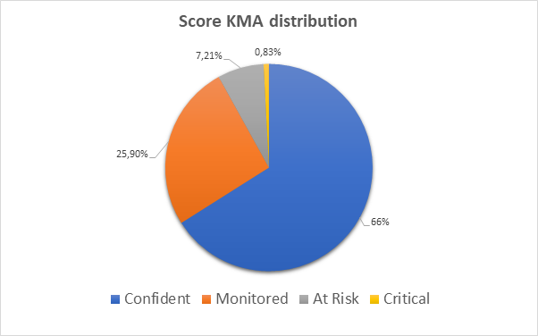
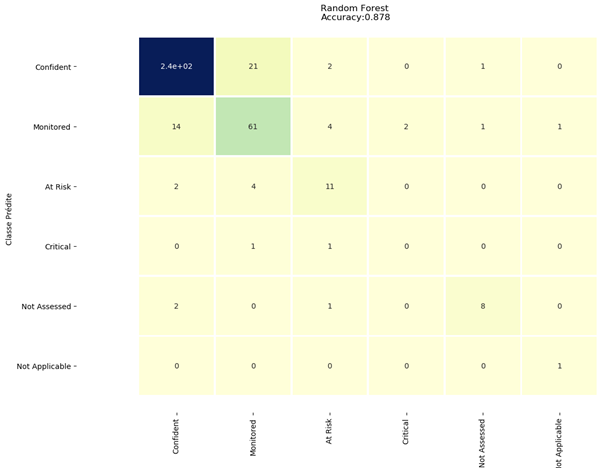

## Introduction
The subject of my internship in the quality department of Thales was to predict the arrival of potential future problems that could arise within the different projects carried out by the different entities of the company. The projects are monitored by different quality engineers who regularly write a quality report evaluating different aspects of the project's progress and therefore highlighting any problems encountered. These reports, which are called Quality Advices, are therefore the data that I processed.

### Quality Advices

A QAdvice is made up of 14 topics covering different aspects of a project, from customer relations to respecting the schedule... These different points are evaluated by the quality engineer according to this scale:
 

  

  <i>Figure 1. KMA scores scale</i>

These different points are called Key Maturity Area (KMA) and therefore compose. Each KMA evaluation is accompanied by 2 comments. The first one is a finding comment which is there to justify the grade given by the engineer. It is therefore used to describe a problem. The second one is a recommendation comment which is used to inform the team to evaluate actions or decisions to be implemented to solve the problem. This report is formatted as an excel file like this :
 

  

  <i>Figure 2. Presentation of a QAdvice</i>

 The objective of this project is therefore to try to predict the value of the next KMA scores of the future QAdvice. Thus it will be possible to predict potential problems on some specific points.
 
### The Data

The starting data was simply a .csv file containing more than 2 years of QAdvice from more than 100 projects. It contained the KMA score evaluations, comments and descriptions of the projects in question.
However, the raw data is not directly usable to train a learning machine model. It was therefore necessary to do some pre-processing work. So I decided to transform the date into several columns: the date of the day, the day of the week, the season, the month ...
But with these simple modifications, the first results of the first models were not very satisfactory (about 60% of precisions), so I added metrics allowing the different models to better apprehend the data set. That's why I added statistics on the previous KMA scores of the previous QAdvices.
Another variables that were not exploited were the comments of the KMA scores. For their value data I decided to use a sentiment analyzer from an NLP library(NLTK). Thus, each comment is rated by a score from 1 to 4 transcribing the positivity or negativity of the comment left by the quality engineer. This makes it possible to correlate the KMA score with the engineer's opinion.

Once the data was processed, I was able to train the first relevant models. Here are the results obtained: 

  

  <i>Figure 3. Details of different models of Machine Learning</i>

 
The best performing model here is the random forest with almost 88% accuracy. The following are the most important variables in the decisions made by the model:

  

  <i>Figure 4. Variables determining model predictions</i>

 

### Random Forest
We noticed earlier that the best performing learning machine model on our dataset was the Random Forest algorithm. So we will see in this section how it works and why it is so efficient with the Thales data analyzed.

The algorithm underlying this model is quite recent and dates from 2001. The algorithm, as its name suggests, is based on the creation of multiple decision trees forming a forest. The randomness depends on the way each tree is created. To form these trees, the model randomly takes samples of data. For each tree, a bootstrat sample of individuals is selected, so that the construction of a tree node is based on a subset of randomly drawn variables. 

  

  <i>Figure 5. How the Random Forest algorithm works</i>

Once the trees are created, the model can make predictions by passing new information as arguments in each tree. Each tree then submits a prediction. All tree responses are then retrieved and the most frequent value is chosen as the final prediction.

The advantage of Random Forest's algorithm over other models is that it leads to great precision with great disparities in the proportions of classes to predict, which is the case in our data set : 

  

  <i>Figure 6. KMA scores distribution</i>

The model is also not subject to the problem of "overfitting" which is a phenomenon often found in machine learning models. Overfitting is the fact that the model performs very well on learning and test data, but once subjected to real data, it is less efficient. Only, the random forest program suffers from a "black box" effect because the mechanisms leading to the prediction made are not obvious to identify. There is, however, a way of knowing which variables have the most weight in the model's decision making thanks to Gini index calculations.  

### Improvements

I've developed a predictive model that's 88% correct. But, still, 12% of the predictions are wrong. So we're going to look at the predictions themselves and therefore understand how our model works. Here is the confusion matrix of the current model: 

  

  <i>Figure 7. Confusion matrix of the current model</i>

In case the prediction is bad, it will be able to warn the quality engineer of this problem in order to either bring it up or at best prevent it. When a prediction is wrong, we can distinguish 2 cases:
- The prediction is pessimistic compared to the reality, making it sound a false alarm.
- The prediction is optimistic and a problem that may exist is not then detected.
In one case, the model is wrong, having for only consequence to alarm for nothing the engineer. In the other case, the problem is not detected, worse, it is masked by an overly optimistic prediction. We will therefore try to reduce this occurrence as much as possible. To do this, I have tried to create a pessimistic model.

It is noticeable that the model is similarly wrong one way or the other. The sensitivity of the model must therefore be increased in the negative direction. To do this we will use a method called "upsampling" which is to readjust the proportions of the classes in our dataset. We will then artificially increase the number of critical, risky and monitored KMA evaluations so that they have more weight in the decision making of its classes.

Here are the results on the accuracy of the model as well as its confusion matrix:  

  

  <i>Figure 8. Confusion matrix of the new model</i>

Here we can see that the accuracy is degraded by about 3%. However, the predictions made are now more pessimistic. This can be seen on the confusion matrix where errors on the upper part are less frequent. They are however more frequent on the lower part. 

### Conclusion
